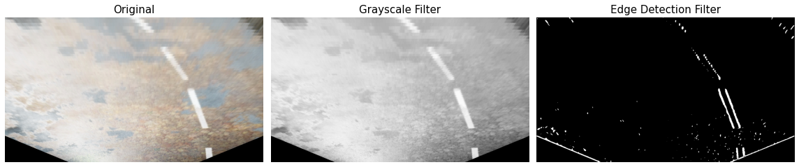

# AI-Pilot

AI-Pilot: autonomous pilot research using computer vision and deep learning. 
Goal of this personal project is creating decision tree models for autonomous driving using different input datasets and
popular machine learning frameworks.  

---
## Computer Vision

Computer vision and image processing used for producing features from input images for curved lane detection and object 
detection.  

### Curved lane detection
Curved lane detection is a fundamental problem for self-driving systems and so the starting point of this research. 
The following general algorithm used to generate the features describing the lanes in a given input image:

1. [Warp projection](notebooks/computer_vision/lane_detection/warp_projection.ipynb)
1. [Perspective distortion](notebooks/computer_vision/lane_detection/perspective_distortion.ipynb)
1. [Edge detection using gaussian, bilinear, sobel and canny filters ](notebooks/computer_vision/lane_detection/edge_detection.ipynb)

1. [Curve fitting using pixel density stacked rectangles](notebooks/computer_vision/lane_detection/curve_fitting.ipynb)

### Object detection
Work in progress, intending to use YOLOv3 with a public trained model in first moment to generate features.

---
## References:

* [arXiv: End to End Learning for Self-Driving Cars](https://arxiv.org/abs/1604.07316)
    * [NVIDIA: End-to-End Deep Learning for Self-Driving Cars](https://developer.nvidia.com/blog/deep-learning-self-driving-cars/)
    * [NVIDIA: Explaining How End-to-End Deep Learning Steers a Self-Driving Car](https://developer.nvidia.com/blog/explaining-deep-learning-self-driving-car/)

* [arXiv: Learning a Driving Simulator](https://arxiv.org/abs/1608.01230)
    * [GitHub: commaai/research](https://github.com/commaai/research)
    
* [MIT AgeLab: MIT DriveSeg Dataset for Dynamic Driving Scene Segmentation](https://agelab.mit.edu/driveseg)
    * [arXiv: Value of Temporal Dynamics Information in Driving Scene Segmentation](https://arxiv.org/pdf/1904.00758.pdf)
    * [iEEE: MIT DriveSeg (manual) dataset](https://ieee-dataport.org/open-access/mit-driveseg-manual-dataset)
    * [iEEE: MIT DriveSeg (Semi-auto) dataset](https://ieee-dataport.org/open-access/mit-driveseg-semi-auto-dataset)

