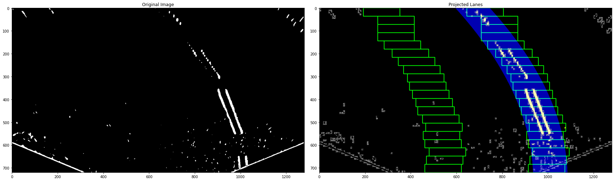

# AI-Pilot

## Curved lane detection feature production
Curved lane detection is a fundamental problem for self-driving systems and so the starting point of this research. 
The following general algorithm used to generate the features describing the lanes in a given input image:

1. [Warp projection area](warp_projection.ipynb)

1. [Perspective distortion 'bird eye view'](perspective_distortion.ipynb)

1. [Edge detection using gaussian, bilinear, sobel and canny filters ](edge_detection.ipynb)

1. [Polynomial curve fitting using pixel density stacked rectangles](curve_fitting.ipynb)

1. Example results (used as input features)
   * [Result image](../../../doc/images/lane_detection_image_curve_fit.jpg)
   * [Result feature set](../../../doc/json/lane_detection_features.json)

## References:

* [Finding Lane Lines for Self Driving Cars by Ross Kippenbrock](https://pydata.org/berlin2017/schedule/presentation/51/)